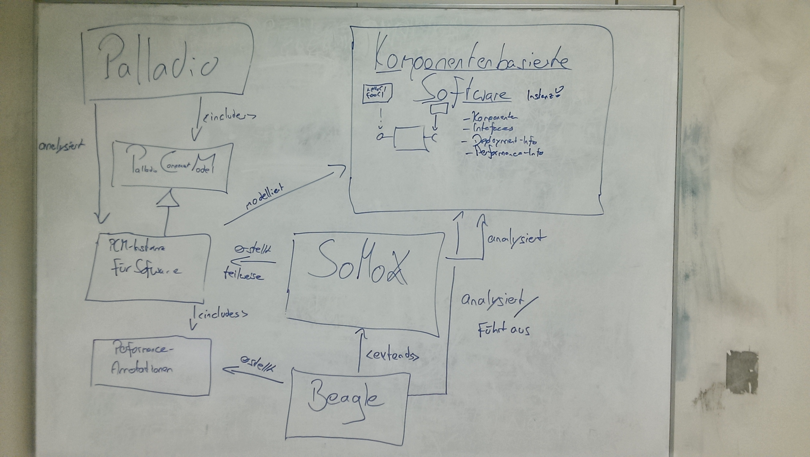

# Beagle's purpose
### The tools and interactions around Beagle

_**Disclaimer**: The following information is a personal understanding at a very early point. It may be outdated, misleading, incomplete or plain wrong._

In a discussion about what Beagle actually does, the following chart has been created:

Despite being German, it serves as a brief overview about what Beagle is trying to achieve. It speaks for itself. However, some additional information shall be provided:

**Correction**: In the chart above, the PCM instance is drawn with an UML `<<is a>>` relation towards PCM. This was a mistake. The author meant to use an `<<instance of>>` relation.

#### Palladio
[Palladio](https://sdqweb.ipd.kit.edu/wiki/Palladio_Component_Model) is a software developed at the [Chair for Software Design and Quality (SDQ)](http://sdq.ipd.kit.edu/) at the KIT. It models and analyzes component based software. At its core, Palladio focuses on performance analysis and prediction of a modeled system, although it was extended to work with other characteristics, too.

#### PCM
PCM (Palladio Component Model) is a part of Palladio. It's a modeling language used to describe component based software. As a meta model it describes how to build models which describe software.

#### PCM instance for Software
A software is modeled by one or several instances of the PCM. Palladio does not analyze the software (e.g. its source code) itself, but instead works with a model of it. This makes sense as Palladio was originally invented to simulate software systems which had yet to be implemented.

#### Performance Annotations
Among much other information, PCM allows to annotate the performance resources which a component requires to offer a certain interface. These annotations may be parameterized, such that a certain action may for example require `n * 10 000` cpu cycles if called with input parameter `n`. Annotations allow Palladio to examine how software will perform when simulating its execution.

#### SoMoX
Palladio is great for predicting performance (and other) characteristics of not yet implemented software systems. However, there are a lot of use cases where existing software is to be analyzed by Palladio. This may for example be wished to increase the software's performance, to document the software's architecture or to plan refactorings. However, modeling existing software in Palladio takes a serious amount of time and may be a big hurdle preventing users from using Palladio.

SoMoX is a tool for static code analysis. It takes Java code and tries to find its component structure. It produces an instance of the PCM which describes the software including its components and ascertained interfaces, as well as the connections between them.

#### Beagle
SoMoX cannot provide performance annotations as it's limited to static code analysis. Beagle shall now step in after SoMoX finished its analysis and extract such performance features. To achieve that, it actually executes the provided code.
As described above, performance annotations are crucial for Palladio. To provide performance information, Beagle will annotate _resourse demands_ (like CPU and HDD usage) on _internal actions_ ("coarse–grained blocks of instructions within a compenent") in the PCM instance. Preferably, resource demands will be parameterized by interface arguments.
