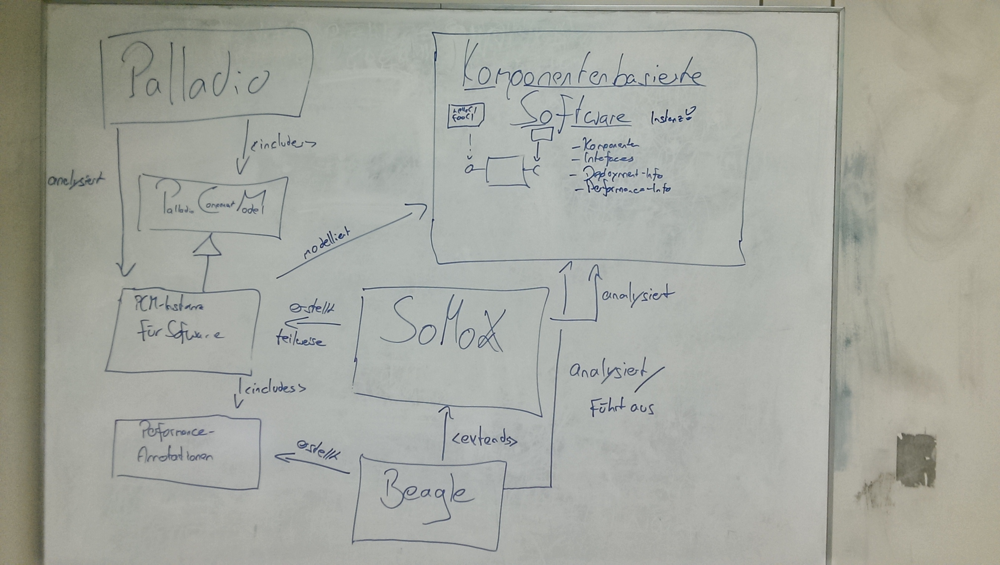

# What does Beagle?

_**Disclaimer**: The following information is a personal understanding at a very early point. It may be outdated, misleading, incomplete or plain wrong._

In a discussion about what Beagle actually does, the following chart was created:

Despite being german, it serves as a brief overview about what Beagle is trying to achieve. It speaks for itself, however, some additional information shall be provided:

#### Palladio
[Palladio](https://sdqweb.ipd.kit.edu/wiki/Palladio_Component_Model) is a software developed at the [Chair for Software Design and Quality (SDQ)](http://sdq.ipd.kit.edu/) at the KIT. It models and analyzes component based software. At its core, Palladio focuses on performance analysis and prediction of a modeled system, although it was extended to work with other characteristics, too.

#### PCM
The PCM is a part of Palladio. It is a modeling language to describe component based software. It is a meta model: It describes how to built models that describe software.

#### PCM instance for Software
A software is modeled by an (or multiple) instance(s) of the PCM. Palladio does not analyze the software (e.g. its source code) itself, but rather works with a model of it. This makes sense, as Palladio was initially invented to simulate software systems before they are implemented.

#### Performance Annotations
Among much other information, the PCM allows to annotate performance resources a component requires to offer a certain interface. These annotations may be parameterized, such that a certain action may for example require `n * 10 000` cpu cycles if called with input parameter `n`. The annotations allow Palladio to simulate how software will perform.

#### SoMoX
Palladio is great for predicting performance (and other) characteristics of not yet implemented software systems. However, there are a lot of use cases where existing software is to be analyzed by Palladio. This may for example be wished to increase the software's performance, to document the software's architecture or to plan refactorings. However, modeling existing software in Palladio takes a serious amount of time and may be a big hurdle preventing users from using Palladio.

SoMoX is a tool for static code analysis. It takes Java code and tries to find its component structure. It produces an instance of the PCM that describes the software. This includes the components and interfaces found, as well as the connections between them.

#### Beagle
SoMoX cannot provide performance annotations, as it's limited to static code analysis. Beagle shall now step in once SoMoX is done and extract such performance features. To achieve that, it actually executes the provided code. 
As described above, performance annotations are crucial for Palladio.